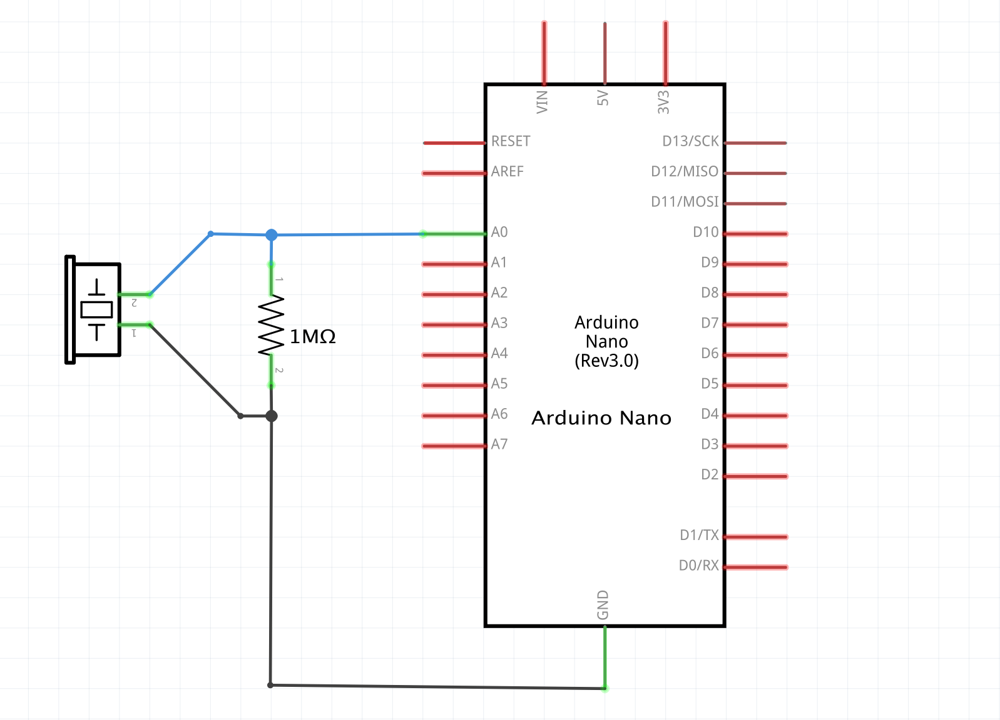
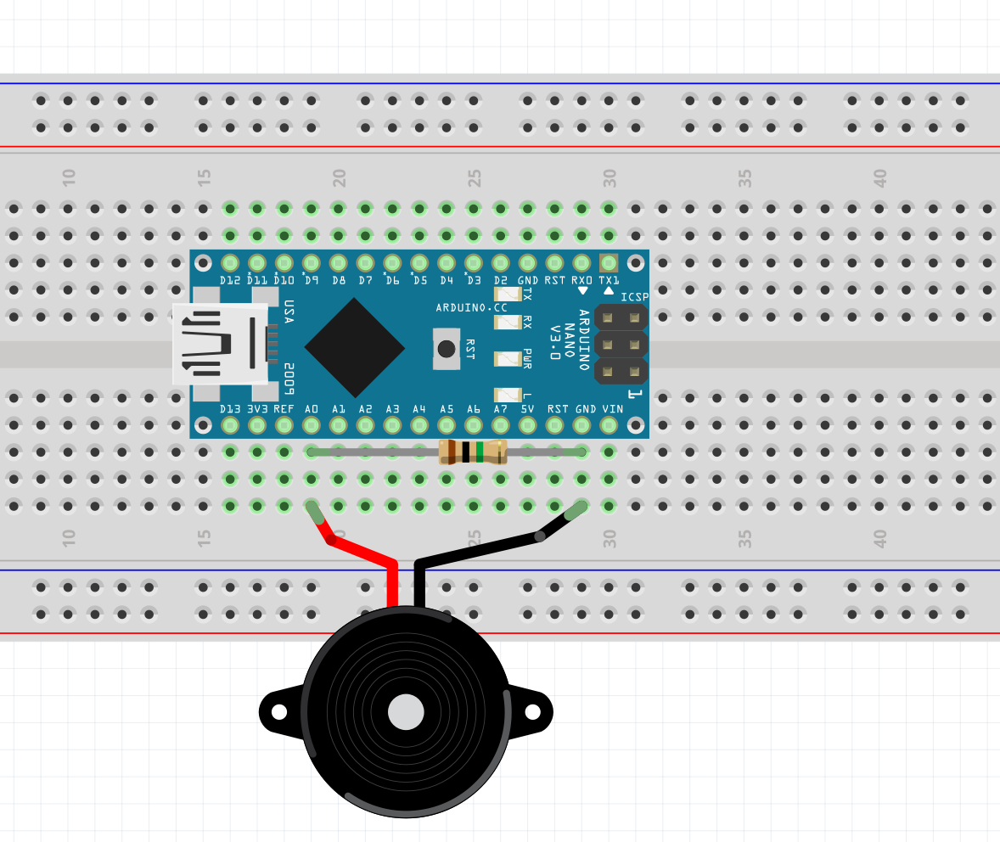

# 05_analogRead_piezo

An example of how to use a piezoelectric sensor to detect knocks on a surface. The code also shows how to debounce a noisy/sensitive analog input signal and only consider one value change per action.

Schematic:

Board:

